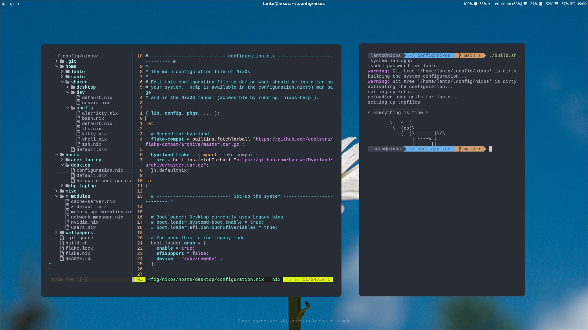
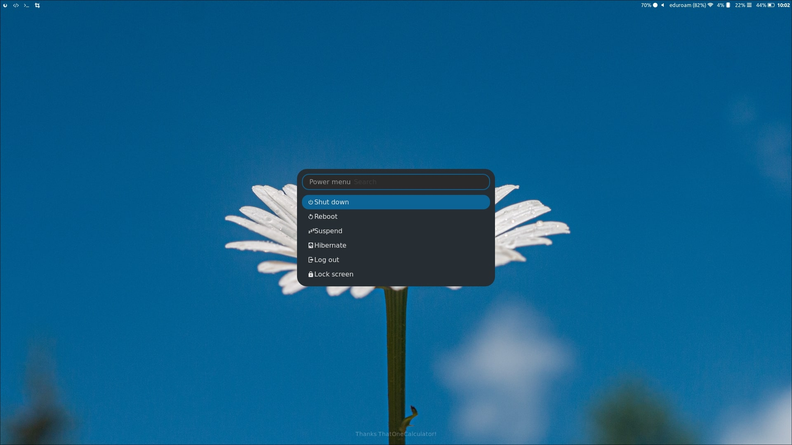

<h1 align="center">Welcome to my NixOS config files!</h1>

<p align="center">
  
  
</p>

<p align="center">
  NixOS is a fully reproducible operating system based on the Nix package manager. A good guide on NixOS can be found <a href="https://nixos-and-flakes.thiscute.world/introduction/">here</a>.
</p>







# 🛠️ What I use
| What | Item |
|----------|---------|
| OS | NixOS \w Flakes && Home-Manager |
| Display Manager | Wayland |
| Compositor | HyprLand |
| Bar | Waybar |
| Notification Manager | Dunst |
| Audio | Pipewire |
| App Launcher | Rofi |
| Network | Network-Manager |
| Take Screenshots | Grim + Slurp + Wl-clipboard |
| Terminal Emulator | Kitty |
| Shell | Zsh |
| Wallpaper Manager | Hyprpaper |
| Email client | Thunderbird |
| Knowledge Management | Obsidian |
| File Manager | Thunar / Ranger |
| Editor | Neovim |
| Browser | Vivaldi |
| Change Brightness | Brightnessctl |

## Vim plugins
| Name | Description |
| ---- | ----------- |
| nvim-tree-lua | Directory Tree |
| vim-stratify | Fancy Start Screen |
| nerdtree              | Another Directory tree |
| surround-nvim         | Shortcut to surround a work with char |
| syntastic             | Code syntax checking for a lot of languages |
| YouCompleteMe         | Code completition for most languages |
| vim-airline           | Bottom bar with some informations |
| emmet-vim             | Amazing html completition |
| telescope-zoxide      | Fuzzy finder |
| fine-cmdline          | Better looking command line |
| nvim-colorizer-lua    | Show hex colors immediately |
| gitsigns-nvim         | Hilight text that has changes since last commit |
| copilot-nvim          | Github's AI assistant |

# 🔩 My Hardware

## 🖥️ Computers

| Name             | System | Role                       | Notes                                                                     | User   |
| ---------------- | -------| -------------------------- | ------------------------------------------------------------------------- | ------ |
| Desktop          | NixOS  | Main workstation for computation and Gaming | i5-6500K 3.2 GHz, Nvidia 1060 3G, 16 GB ram DDR4, AC-Game Mechanical Keyboard, HP Monitor, Creative Speakers, Gaming Mouse | santo |
| Hp Laptop        | NixOS  | University Note taking and Programming when I'm outside  | -      | lanto |
| Laptop Acer      | NixOS  | Tests and Backups         | - | santo |
| Computerino      | Ubuntu Server |Backups and Server  | - | santo | 
| Laptop 3 | Archlinux | - | - | - |
| Laptop 4 | Debian  | - | Too old to be useful | - |

## 🔌 Devices

| Nome         | Role                | Notes  |
| ------------ | ------------------- | ------ |
| Kingdian SSD | Archlinux Boot      | 100 GB |
| USB Stick    | Installation Media  | 8 GB   |
| Samsung A13  | Main Phone          |        |
| Samusng J6   | Wifi Hotspot        |        |
| Launchpad S  | App-launcher        |        |


# 🪛 Use my config files

Clone my repo, then add `.secrets/` directory with the file `.secrets/github-access-token`

Make sure there is no new line in the file (`0x0a`)


Build the system with with
```bash
sudo nixos-rebuild switch --flake .<profile-here> --impure
```
Or with the `build.sh` script
```bash
./build.sh system <profile-here>
```
impure lets you read gihub credentials from .secrets

I don't place my config in `/etc/nixos/` but I have this repo on my home inside `.config/nixos`

## 🏗️ Structure
Take a look around (might not be updated to the lastest version)
``` 
├── build.sh                        # Easy to use build script
├── flake.lock                      # Lock file for flakes
├── flake.nix                       # All flakes profiles are defined here
├── home                            # Home Manager configurations
│   ├── lanto                       # Minimal user with just the necessary stuff
│   │   ├── default.nix             
│   │   └── dev
│   │       ├── default.nix
│   │       └── git.nix             # Git configurations and setting up credentials
│   ├── santo                       # Power user with many programs
│   │   ├── default.nix
│   │   ├── dev
│   │   │   ├── default.nix
│   │   │   └── git.nix
│   │   └── programs
│   │       └── default.nix
│   └── shared                      # Pakages and configurations shared between users
│       ├── default.nix
│       ├── desktop
│       │   ├── default.nix
│       │   ├── hyprland.conf       # Hyprland
│       │   ├── hyprpaper.conf      # Wallpapers
│       │   ├── i3.nix
│       │   ├── neofetch.nix
│       │   ├── ranger.nix
│       │   ├── rofi.nix
│       │   └── waybar.nix
│       ├── dev
│       │   ├── default.nix
│       │   └── neovim.nix          # Neovim Plugins
│       └── shells
│           ├── alacritty.nix
│           ├── bash.nix
│           ├── default.nix
│           ├── fhs.nix             # FHS filesystem
│           ├── kitty.nix           # I use kitty
│           ├── shell.nix
│           └── zsh.nix
├── hosts                           # Configuration specific per machine
│   ├── acer-laptop                 # Backup / Second Laptop
│   │   ├── configuration.nix
│   │   ├── default.nix
│   │   └── hardware-configuration.nix
│   ├── desktop                     # Main workstation, nvidia drivers
│   │   ├── configuration.nix
│   │   ├── default.nix
│   │   └── hardware-configuration.nix
│   └── hp-laptop                   # Unversity note taking and programming
│       ├── configuration.nix
│       ├── default.nix
│       └── hardware-configuration.nix
├── misc                            # Some notes I took that I might need in future
│   ├── powertop.md
│   └── screenshots
│       ├── 01.jpg
│       ├── 02.jpg
│       ├── 03.jpg
│       └── 04.jpg
├── modules                         # System-wide configuration and packages
│   ├── cache-server.nix
│   ├── default.nix                 # All system packages
│   ├── memory-optimization.nix
│   ├── network-manager.nix
│   ├── nvidia.nix                  # Nvidia settings
│   └── users.nix
├── README.md
└── wallpapers                      # A bunch of wallpapers 
    ├── anime1.jpeg
    ├── anime2.jpeg
    ├── anime3.jpeg
    ├── fishing.png
    ├── free-as-in-freedom.jpeg
    ├── grass.jpg
    ├── lake.png
    ├── mountain.png
    ├── nixos-dark.png
    ├── nixos-light.png
    ├── only-grey.png
    └── telescope.png

```

# 🏠 home-manager

You can manage the user environment without sudo thanks to home manager. Inside `flake.nix` there is a profile for `santo@home` that imports the modules at `home/santo/`. You can build your profile with home-manager with this command:
```bash
home-manager switch --flake flake.nix#santo@home --impure
```
Or with my build script
```bash
./build.sh home santo@home
```

# 🐚 nix-shell

For developement consistency, NixOS uses (enforces...) the use of nix-shell (or `nix develop` for flake configuration). You can create and enter into developement environment it with the command `nix-shell`. You can provide the packages with `-p` or use a configuration file like so:
`modules/shell/shell.nix`
```nix
{ pkgs ? import <nixpkgs> {} }: pkgs.mkShell {
  nativeBuildInputs = with pkgs.buildPackages; [
    libgcc
    # cargo
    # rustc
  ];
}
```
See `modules/shell/shell.nix` for more information.

Example usage
```bash
nix-shell -p gcc
nix-shell /path/to/shell/configuration.nix
nix develop nixpkgs#gcc
```
With `nix develop` you mantain in scope all your user programs

## Run a FHS shell
```bash
nix-shell home/shared/fhs.nix
```


## Run Appimage
```bash
nix-shell -p appimage-run
[nix-shell]$ appimage-run <your-appimage>
```

## ⬆️  Upgrade the system
```bash
nix flake update
```

## 🗑️ Remove Garbage
Remove system versions and packages no longer used by new generations by 15 days
```bash
nix-channel --update
sudo nix-channel --update
sudo rm /nix/var/nix/gcroots/auto/*
nix-collect-garbage -d
sudo nix-collect-garbage -d
sudo nix-store --optimize
```
## Create a new module

Create a file such as `main-user.nix`
Then add It into the `configuration.nix` file
```nix
imports = [
	./hardware-configuration.nix
	./main-user.nix
]
```

In `main-user.nix`
```nix
{ whatever, ... }:

{
   # Config here
}
```

### Default
If you call a file `default.nix`, you can access It just bu importing It's folder


## Finding options and functions

```bash
nix search nixpkgs <searchterm>
```

# 🎥 Rerources
## Videos
https://www.youtube.com/watch?v=CwfKlX3rA6E

https://www.youtube.com/watch?v=a67Sv4Mbxmc

https://www.youtube.com/watch?v=1ED9b7ERTzI

## Sites
https://search.nixos.org/options?channel=23.11&from=0&size=50&sort=relevance&type=packages&query=git

https://search.nixos.org/packages?channel=23.11&show=git&from=0&size=50&sort=relevance&type=packages&query=git

---

# TODO

- [ ] Login Manager
